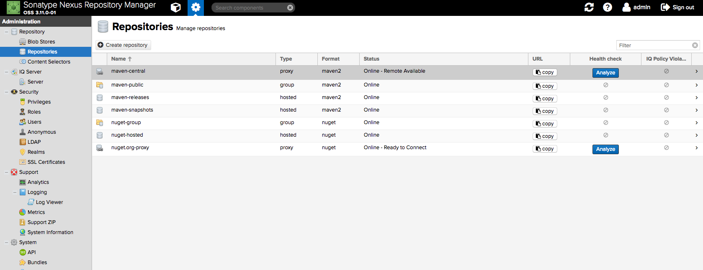
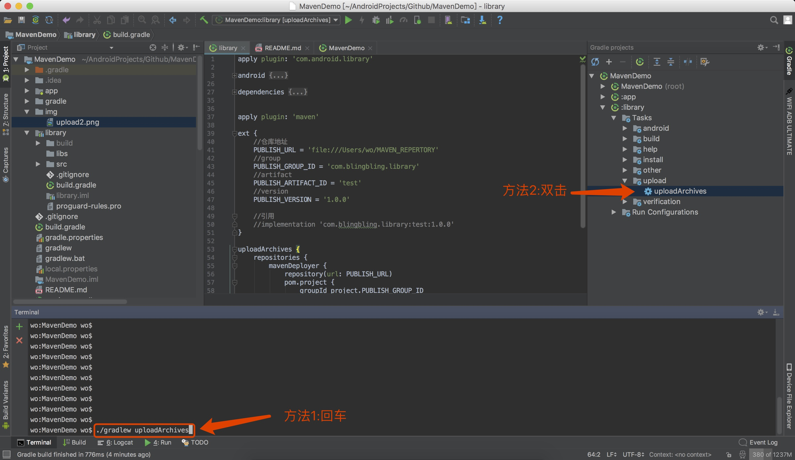

# maven仓库发布和引用

[github 搭建 maven](https://github.com/1109993488/MavenRepository)

## nexus下载和安装

### 下载地址：

http://www.sonatype.com/nexus-repository-oss

### 安装：

Linux、Mac版的无需安装，直接解压即可，然后进入bin目录下, 运行 ./nexus start ，启动服务

```sh
# 下载
# unix
wget https://download.sonatype.com/nexus/3/latest-unix.tar.gz
# mac
wget https://download.sonatype.com/nexus/3/latest-mac.tgz

# 解压
tar -xf last-unix.tar.gz -C /usr/local/nexus
# 然后我们进入到 /usr/local/nexus/nexus-3.11.0-01/bin 目录下
cd /usr/local/nexus/nexus-3.11.0-01/bin
```

### 用户界面

1. 在地址栏里输入服务IP地址和8081端口就可以打开用户界面，例如 http://127.0.0.1:8081

修改默认8081端口
```
打开 /nexus-3.11.0-01-mac/sonatype-work/nexus3/etc/nexus.properties
修改ip： application-host
修改端口： application-port
```

2. 点Sign In登录管理页面，用户名密码为，admin和admin123

3. 在Repositories页面里显示着，默认已经创建了5个仓库（2个为group），直接可以拿来用，无需再自行创建仓库。



#### Repository的type属性有：proxy，hosted，group三种。

- proxy：即你可以设置代理，设置了代理之后，在你的nexus中找不到的依赖就会去配置的代理的地址中找
- hosted：你可以上传你自己的项目到这里面
- group：它可以包含前面两个，是一个聚合体。一般用来给客户一个访问nexus的统一地址。

### 创建 repository

点击 Create repository, 选择 maven2, 输入仓库名 my-test-hosted 创建

## 配置上传

### 新建 library 模块并修改 build.gradle

```gradle
apply plugin: 'com.android.library'

android {...}

dependencies {...}


apply plugin: 'maven'

ext {
    // maven仓库地址
    PUBLISH_URL = 'http://127.0.0.1:8081/repository/my-test-hosted/'

    // group
    PUBLISH_GROUP_ID = 'com.blingbling.library'
    // artifact
    PUBLISH_ARTIFACT_ID = 'util'
    // version
    PUBLISH_VERSION = '1.0.0'

    // user
    USER_NAME = 'admin'
    USER_PASSWORD = 'admin123'
}

uploadArchives {
    repositories {
        mavenDeployer {
            repository(url: PUBLISH_URL) {
                authentication(userName: USER_NAME, password: USER_PASSWORD)
            }
            pom.project {
                groupId PUBLISH_GROUP_ID
                artifactId PUBLISH_ARTIFACT_ID
                version PUBLISH_VERSION
            }
        }
    }
}
```

SNAPSHOT版本可以增加

```gradle
//版本号后面增加 -SNAPSHOT
PUBLISH_VERSION = '1.0.0-SNAPSHOT'

// maven仓库地址
PUBLISH_SNAPSHOT_URL = 'http://127.0.0.1:8081/repository/my-test-hosted-SNAPSHOT/'

uploadArchives {
    repositories {
        mavenDeployer {
            repository(url: PUBLISH_URL) {
                authentication(userName: USER_NAME, password: USER_PASSWORD)
            }
            snapshotRepository(url: PUBLISH_SNAPSHOT_URL) {
                authentication(userName: USER_NAME, password: USER_PASSWORD)
            }
            pom.project {
                groupId PUBLISH_GROUP_ID
                artifactId PUBLISH_ARTIFACT_ID
                version PUBLISH_VERSION
            }
        }
    }
}
```

### 上传



## 引用

```gradle
allprojects {
    repositories {
        google()
        jcenter()

        // maven仓库地址
        maven { url 'http://127.0.0.1:8081/repository/my-test-hosted/' }

        // 带认证的仓库库
        maven {
            url 'http://127.0.0.1:8081/repository/my-test-hosted'
            credentials {
                username 'admin'
                password 'admin123'
            }
        }
    }
}

// 使用
dependencies {
    implementation 'com.blingbling.library:util:1.0.0'
}
```

## 配置本地仓库

```gradle
// 把maven地址改为本地文件夹
PUBLISH_URL = rootProject.uri("MEVEN_REPOSITORY")

uploadArchives {
    repositories {
        mavenDeployer {
            // 本地仓库不需要验证用户
            repository(url: PUBLISH_URL)
            pom.project {
                groupId PUBLISH_GROUP_ID
                artifactId PUBLISH_ARTIFACT_ID
                version PUBLISH_VERSION
            }
        }
    }
}

// 引用本地maven仓库地址
maven { url rootProject.uri("MEVEN_REPOSITORY") }
```
